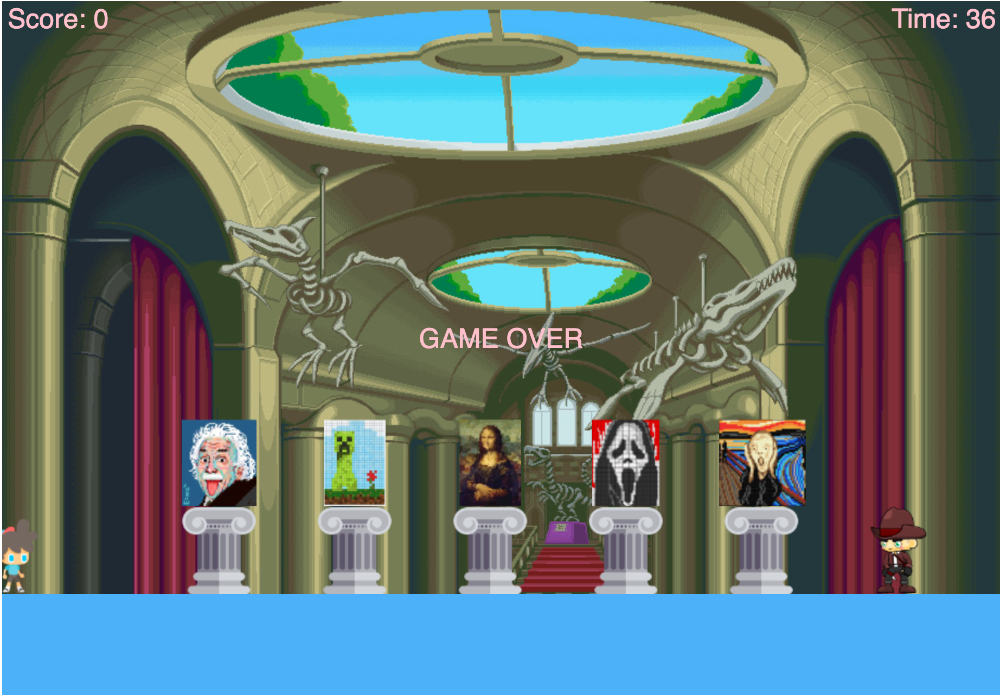

# Night at the Museum
Night at the Museum is a browser game that uses the p5.js library.

## Introduction
Night at the Museum is our Module 3 project where we were first introduced to Javascript as well as DOM manipulation. Night at the Museum is a browser game that uses the p5.js library (more specifically the p5.play library) to create a canvas on the DOM giving us access to sprite objects and draw functions. 

## Table of Contents
1. [Technologies](#technologies)
2. [Setup](#setup)
3. [Instructions](#instructions)
4. [Controls](#controls)
5. [Site](#site)
6. [Authors](#authors)

## Technologies <a name="technologies"></a>
* JavaScript 
* [p5.js](https://p5js.org/) [(p5.play)](http://molleindustria.github.io/p5.play/) - a JavaScript library which provides collision detection, gravity, animation support, and many other simple game physics.

## Setup <a name="setup"></a>
To run this project locally, while in the project directory run
```
npm install
```
and launch LiveServer via the VSCode extention.

## Instructions <a name="instructions"></a>
Night at the Museum is a game similar to the children's game "Red Light Green Light". You play as a thief that has broken into the museum to steal paintings. There is security but they are sleeping on the job. You must try and steal all the paintings within time limit without getting caught by security. When security is about to wake up, you will hear a sudden alert sound. You will have 1 second to crouch from the guard's view. Steal all the paintings to beat the game!

## Controls <a name="controls"></a>
UP = Steal the painting (must hold for a duration before painting is stolen succesfully)     
DOWN = Crouch from the guard's sight (must hold to keep staying crouched)    
LEFT/RIGHT = directional buttons to move

## Site <a name="site"></a>


## Authors <a name="authors"></a>
|  | 
 
| :-: | :-: |
| [Christopher Truong](https://github.com/cStruong) | [Joshua Rivera-Sampayo](https://github.com/joshrs1199) |
